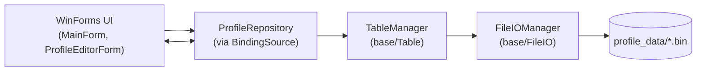

# Trình quản lý hồ sơ học sinh

## Ý tưởng chính
- Ứng dụng WinForms giúp quản lý hồ sơ học sinh với khả năng tìm kiếm, lọc theo ngày sinh, thêm/sửa/xóa và nạp dữ liệu mẫu.
- Lõi lưu trữ dựa trên thư viện `BasicDataBase`, sử dụng tệp nhị phân kèm chỉ mục để thao tác nhanh mà không cần cơ sở dữ liệu ngoài.
- Giao diện cung cấp lưới dữ liệu, hộp thoại biên tập, lớp phủ (overlay) hiển thị mẫu động và cụm công cụ debug (Seed/Wipe).

## Kiến trúc cốt lõi (`base/` và `Profiles/`)
- `base/FileIO`: Quản lý đọc/ghi tệp nhị phân, ánh xạ schema, chuyển đổi kiểu dữ liệu và xây dựng chỉ mục tìm kiếm.
- `base/Table`: `TableManager` điều phối việc tạo bảng, truy vấn bản ghi, cập nhật, xóa và xử lý chỉ mục cây tìm kiếm nhị phân.
- `Profiles/ProfileRepository.cs`: Bao bọc `TableManager`, chuẩn hóa schema hồ sơ, cung cấp CRUD, tìm kiếm tiền tố/toàn phần, lọc ngày và thao tác xóa toàn bộ.
- `Profiles/ProfileRecord.cs`: Định nghĩa mô hình hồ sơ với 15 trường (ID, họ tên, năm sinh, thông tin BHYT/BHXH, trạng thái Đoàn/Đảng…).
- `Profiles/ProfileDataSeeder.cs`: Sinh dữ liệu mẫu tiếng Việt (tên, quê quán, lớp…) phục vụ demo hoặc kiểm thử.

## Thành phần giao diện (`UI/`)
- `UI/MainForm.cs`: Cửa sổ chính, hiển thị bảng, thanh công cụ tìm kiếm, lọc, thao tác CRUD, nhóm debug và overlay mẫu.
- `UI/ProfileEditorForm.cs`: Hộp thoại chỉnh sửa/khởi tạo hồ sơ với bố cục dòng ngang, tự động điền định dạng giá trị.
- `Program.cs`: Điểm vào ứng dụng, khởi động WinForms và tạo thư mục dữ liệu `profile_data`.

## Luồng xử lý chi tiết
```csharp
// UI/MainForm.cs
private void PerformSearch()
{
	var field = fieldCombo.SelectedItem?.ToString() ?? "HoVaTen";
	var value = searchBox.Text.Trim();
	var exact = exactCheck.Checked;
	var rows = repository.Search(field, value, exact);
	BindRows(rows);
}

// Profiles/ProfileRepository.cs
public IReadOnlyList<ProfileRow> Search(string fieldName, string value, bool exact)
{
	var query = value.Trim();
	if (string.IsNullOrWhiteSpace(query)) return GetAll();
	var field = NormalizeField(fieldName);
	if (!exact) return SearchPartial(field, query);
	EnsureIndex(field);
	return Project(tableManager.SearchExact(tableName, field, query));
}
```
- `MainForm` lấy đầu vào người dùng, gọi `ProfileRepository`.
- Repository chuẩn hóa tên cột, chọn chế độ tìm kiếm: chuỗi con hoặc chính xác.
- Với tìm kiếm chính xác, repository buộc `TableManager` xây index rồi ánh xạ danh sách chỉ số hàng trở lại UI.

```csharp
// Profiles/ProfileRepository.cs (trích đoạn CRUD)
public void Add(ProfileRecord record)
{
	var values = ToValues(record);
	tableManager.InsertRecord(tableName, values);
}

public void Update(int index, ProfileRecord record)
{
	var values = ToValues(record);
	tableManager.UpdateRecord(tableName, index, values);
}

public void Delete(int index)
{
	tableManager.DeleteRecord(tableName, index);
}
```
- `InsertRecord`/`UpdateRecord` trong `TableManager` chuyển đổi bản ghi sang dạng nhị phân, ghi xuống tệp và đánh dấu chỉ mục cần tái dựng.
- `DeleteRecord` dọn tài nguyên blob (nếu có), cập nhật bộ đếm và báo dirty index.

## Sơ đồ hoạt động


## Chi tiết cấu trúc dữ liệu chỉ mục (B-Tree đơn giản)
`base/Index/BinarySearchTree.cs` hiện thực một cây tìm kiếm nhị phân (BST) lưu trữ các khóa dạng chuỗi và danh sách chỉ số bản ghi. Ở quy mô dữ liệu vừa và nhỏ, cấu trúc này đóng vai trò tương tự một B-Tree tối giản: khóa được giữ ở nút, giá trị là danh sách index. Khi bảng thay đổi, `TableManager` sẽ làm bẩn (dirty) chỉ mục và dựng lại nếu cần.

```csharp
// base/Index/BinarySearchTree.cs
public void Insert(string key, int recordId)
{
	key ??= string.Empty;
	root = Insert(root, key, recordId);
}

private Node? Insert(Node? node, string key, int recordId)
{
	if (node == null) return new Node(key, recordId);
	int cmp = string.Compare(key, node.Key, StringComparison.Ordinal);
	if (cmp == 0)
	{
		if (!node.Values.Contains(recordId)) node.Values.Add(recordId);
	}
	else if (cmp < 0)
	{
		node.Left = Insert(node.Left, key, recordId);
	}
	else
	{
		node.Right = Insert(node.Right, key, recordId);
	}
	return node;
}
```

- **Chèn (Insert)**: So sánh khóa và đi xuống trái/phải. Nếu khóa đã tồn tại, chỉ thêm chỉ số bản ghi vào danh sách tránh trùng lặp.
- **Xóa (Delete)**: Tìm nút, loại bỏ chỉ số. Nếu danh sách trống, thay nút bằng con trái/phải hoặc nút kế nhiệm nhỏ nhất.
- **Tìm kiếm tiền tố (SearchPrefix)**: Duyệt giữa (in-order) và dừng sớm khi khóa vượt quá tiền tố, giúp truy vấn như `Search("QueQuan", "Ha")` trả về mọi bản ghi chứa các tỉnh bắt đầu bằng “Ha”.
- **Phạm vi (SearchRange)**: Tận dụng tham số `minKey`/`maxKey` để duyệt giới hạn, hỗ trợ lọc `>=`, `<=`, `TOP K` trong `TableManager`.
- **Độ phức tạp**: Khi cây cân bằng, thao tác chính đạt `O(log n)`; trong trường hợp lệch dữ liệu có thể xuống `O(n)`, lý do nên cân nhắc B-Tree/B+Tree đầy đủ cho dữ liệu lớn.

Điểm đáng chú ý:
- Các khóa được lưu dưới dạng chuỗi chuẩn hóa (`NormalizeField` trong repository), đảm bảo thống nhất giữa UI và file data.
- Mọi thao tác cập nhật bản ghi (`InsertRecord`, `UpdateRecord`, `DeleteRecord`) đánh dấu index là “dirty”; lần truy vấn tiếp theo sẽ gọi `BuildIndex` để tái dựng cây từ dữ liệu gốc nhằm tránh trạng thái lệch.
- BST hiện không cân bằng tự động. Với tập dữ liệu lớn cần cân nhắc triển khai B-Tree/B+Tree đầy đủ hoặc cơ chế cân bằng (AVL/Red-Black) để giữ độ sâu ổn định.

```csharp
// base/Table/TableManager.cs
public void BuildIndex(string tableName, string fieldName, bool force = false)
{
	EnsureUserTable(tableName);
	var table = GetOrLoadTable(tableName);
	table.BuildIndex(fieldName, force);
}

// TableDefinition.BuildIndex (tóm lược)
public void BuildIndex(string fieldName, bool force)
{
	if (!force && IndexManager.HasIndex(fieldName) && !IsIndexDirty(fieldName)) return;
	var tree = new BinarySearchTree();
	for (int row = 0; row < RowCount; row++)
	{
		var raw = FileIOManager.ReadRecord(MetadataPath, DataPath, row);
		var key = ExtractField(raw, fieldName);
		tree.Insert(key, row);
	}
	IndexManager.Replace(fieldName, tree);
	MarkIndexClean(fieldName);
}
```
- Mỗi cột lập chỉ mục tương ứng một cây `BinarySearchTree` trong `IndexManager`.
- Tính chất “dirty” được lưu kèm theo tên cột: sau khi ghi dữ liệu, `MarkIndexesDirty()` khiến lần `EnsureIndex` kế tiếp phải chạy `BuildIndex`.
- `Replace` hoán đổi cây cũ bằng cây mới dựng từ dữ liệu hiện tại, đảm bảo tất cả truy vấn (`SearchExact`, `SearchPrefix`, `SearchRange`, `SearchTopK`) đọc từ cùng nguồn đồng bộ.

## Tầng FileIO và cơ chế tuần tự hóa
- `MetaWriter.WriteMetaData` sinh tệp `metadata.meta` lưu schema dạng văn bản cùng quy tắc byte (`SchemaInstruction`).
- `FileIOManager.AppendRecord`/`EditRecord`/`DeleteRecordByIndex` thao tác trực tiếp trên `data.dat`, mỗi bản ghi là một khối byte cố định.

```csharp
// base/FileIO/FileIOManager.cs (lược đồ chung)
public static void AppendRecord(string metaPath, string dataPath, object?[] values)
{
	var instruction = SchemaInstructionCache.Get(metaPath);
	var buffer = SchemaConstruct.Serialize(values, instruction);
	using var stream = new FileStream(dataPath, FileMode.Append, FileAccess.Write, FileShare.None);
	stream.Write(buffer, 0, buffer.Length);
}
```
- `SchemaConstruct.Serialize` duyệt từng field, ghi theo offset/độ dài định sẵn → hỗ trợ truy cập ngẫu nhiên và giảm phân mảnh.
- Chuỗi được mã hóa UTF-8, pad bằng byte 0 tới độ dài tối đa; boolean lưu 1 byte (`0`/`1`); `DateTime` lưu `Ticks` (8 byte).
- Khi đọc, `FileIOManager.ReadRecord` trả về mảng `object?[]`; `TableDefinition.HydrateRecord` chuyển thành kiểu mạnh (`int`, `string`, `DateTime`, `bool`).

### Ví dụ bố cục bản ghi
| Field | Giá trị | Kích thước | Ghi xuống tệp |
|-------|---------|------------|---------------|
| `id` | `101` | 4 byte | little-endian int |
| `hovaten` | `Nguyễn Văn B` | 256 byte | UTF-8 + pad 0 |
| `namsinh` | `2006-05-12` | 8 byte | `DateTime.Ticks` |
| `vaodoan` | `true` | 1 byte | `0x01` |
| ... | ... | ... | ... |

## Dòng đời dữ liệu từ UI tới tệp
1. Người dùng thao tác (Add/Edit/Delete) trên `MainForm`.
2. UI gọi `ProfileRepository`, dữ liệu được chuẩn hóa và chuyển thành `object[]` qua `ToValues`.
3. `TableManager` tuần tự hóa, ghi xuống `data.dat`, cập nhật catalog (`UpdatedAt`) và đánh dấu index dirty.
4. Lần truy vấn tiếp theo (`Search`, `Filter`, `GetAll`) kích hoạt `EnsureIndex` → dựng lại BST nếu cần → trả về danh sách chỉ số.
5. UI nhận danh sách index, đọc bản ghi thực tế bằng `TableManager.GetRecord`, chuyển thành `ProfileViewRow` rồi gán cho `BindingSource`.

## Luồng dữ liệu và cơ sở dữ liệu
1. Người dùng thao tác trên UI (tìm kiếm, thêm, sửa, xóa).
2. `ProfileRepository` chuyển yêu cầu thành lệnh bảng: truy vấn, chèn, cập nhật hoặc xóa.
3. `TableManager` ánh xạ schema, áp dụng tìm kiếm chỉ mục hoặc quét dữ liệu tùy thao tác.
4. `FileIOManager` ghi/đọc tệp nhị phân và duy trì chỉ mục cây nhị phân phục vụ tra cứu nhanh.
5. Kết quả trả về `ProfileRepository`, cập nhật `BindingSource` và lưới dữ liệu.

## Schema hồ sơ
```
id:int
hovaten:string(256)
namsinh:datetime
noisinh:string(256)
quequan:string(256)
lop:string(64)
tongiao:string(64)
gioitinh:string(32)
nienkhoa:string(64)
masobhyt:string(64)
masobhxh:string(64)
diachi:string(256)
sdt:string(32)
vaodoan:bool
vaodang:bool
```

## Các trường hợp sử dụng chính
- Tìm kiếm nhanh theo tên, lớp, quê quán, mã bảo hiểm…
- Lọc chính xác theo ngày sinh khi bật “Exact”.
- Sinh dữ liệu mẫu `Seed 50` để demo/phát triển, xóa sạch dữ liệu bằng `Wipe`.
- Bật lớp phủ template để thử nghiệm hiển thị mẫu động.

## Thiết lập và chạy
```bash
dotnet build
dotnet run
```

Ứng dụng sẽ tạo thư mục `profile_data` cạnh tệp thực thi để lưu tệp dữ liệu và chỉ mục.
